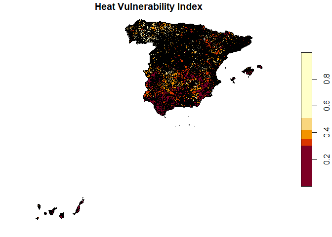

# hvspkg

An R package for assessing heat vulnerability across Spanish
municipalities by integrating demographic data with spatial boundaries.

## Installation

``` r
devtools::install_github("cczablan1/hvspkg")
```

## Usage

``` r
library(hvspkg)

# Join population to municipalities
muni <- join_population_to_municipalities(
  example_municipalities,
  example_population
)
#> Joined 8220 municipalities; 89 have no matching population record.

# Create hvi_municipalities object
hvi_muni <- new_hvi_municipalities(muni)
print(hvi_muni)
#> Heat Vulnerability Municipalities
#> Municipalities : 8220 
#> Provinces      : 53 
#> CRS            : WGS 84 
#> Vulnerable pop : 11662006
summary(hvi_muni)
#> Heat Vulnerability Municipalities - Summary
#> -------------------------------------------
#> Total municipalities     : 8220 
#> Provinces covered        : 53 
#> Total population         : 47400798 
#> Total vulnerable pop     : 11662006 
#> Mean vulnerable pop      : 1434.3

# Compute and plot the heat vulnerability index
hvi <- compute_hvi_score(hvi_muni)
print(hvi)
#> Heat Vulnerability Index
#> Municipalities: 8220 
#> Score range   : [ 0 , 1 ]
#> Mean score    : 0.407
plot(hvi)
```

<!-- -->

## Data sources

- Municipality boundaries: IGN via ArcGIS Living Atlas
- Population by age and sex: INE
- Province codes: INE
