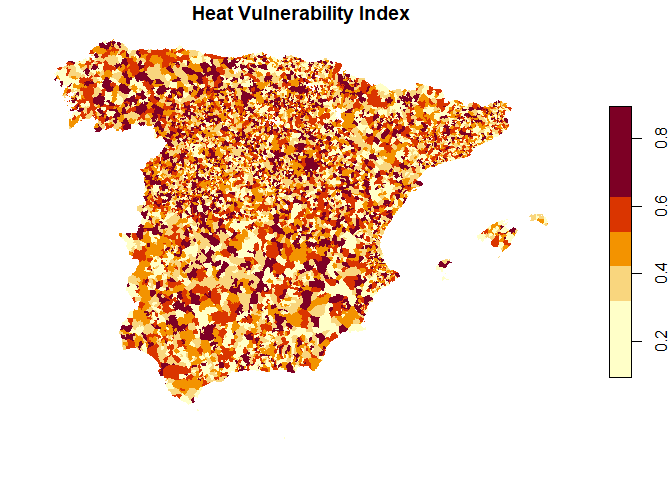

# hvspkg

An R package for assessing heat vulnerability across Spanish
municipalities by integrating satellite-derived land surface temperature
(LST), vegetation indicators (NDVI), and demographic data.

## Installation

``` r
devtools::install_github("cczablan1/hvspkg", ref = "truedata", build_vignettes = TRUE)
```

## Usage

``` r
library(hvspkg)

# Step 1 — Join population to municipalities
muni <- join_population_to_municipalities(
  example_municipalities,
  example_population
)
#> Joined 8220 municipalities; 89 have no matching population record.

# Step 2 — Create hvi_municipalities object
hvi_muni <- new_hvi_municipalities(muni)
print(hvi_muni)
#> Heat Vulnerability Municipalities
#> Municipalities : 8220 
#> Provinces      : 53 
#> CRS            : WGS 84 
#> Vulnerable pop : 11662006
summary(hvi_muni)
#> Heat Vulnerability Municipalities - Summary
#> -------------------------------------------
#> Total municipalities     : 8220 
#> Provinces covered        : 53 
#> Total population         : 47400798 
#> Total vulnerable pop     : 11662006 
#> Mean vulnerable pop      : 1434.3
```

``` r
# Step 3 — Extract raster statistics (requires TIF files)
hvi_muni <- extract_raster_to_municipalities(
  hvi_muni,
  lst_path  = "data-raw/spain_LST_2021.tif",
  ndvi_path = "data-raw/spain_NDVI_mean_2021.tif"
)
```

``` r
# Step 4 — Compute and plot the Heat Vulnerability Index
hvi <- compute_hvi_score(hvi_muni)
print(hvi)
#> Heat Vulnerability Index
#> Municipalities: 8220 
#> HVI range     : [ 0.095 , 0.894 ]
#> Mean HVI      : 0.472
plot(hvi)
```

<!-- -->

## Data sources

- Municipality boundaries: IGN via ArcGIS Living Atlas
- Population by age and sex: INE
- LST: MODIS MOD11A2.061 (NASA LP DAAC)
- NDVI: MODIS MOD13Q1.061 (NASA LP DAAC)
- Province codes: INE
