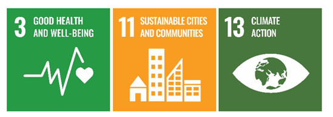
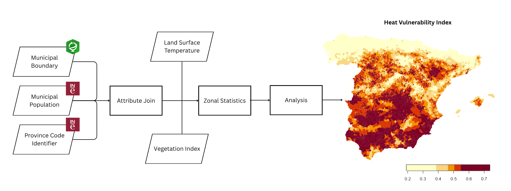

```{r setup, include = FALSE}
knitr::opts_chunk$set(collapse = TRUE, comment = "#>")
library(sf)
library(hvspkg)
```

## Abstract

Southern Europe is increasingly exposed to extreme heat events, intensifying
heat-related risks to human health. This exploratory study assesses heat
vulnerability across Spanish municipalities by integrating satellite-derived
land surface temperature (LST), vegetation indicators (NDVI), and demographic
data. MODIS products are used to capture spatial patterns of surface temperature
and vegetation cover, which are analysed alongside population estimates for
vulnerable age groups, specifically children under five and adults aged
sixty-five and above.

The results reveal clear spatial variability in heat vulnerability across Spain,
with several municipalities exhibiting both elevated surface temperatures and
higher proportions of vulnerable populations. By combining remotely sensed
environmental indicators with socio-demographic data, this study identifies
priority areas for targeted heat mitigation and climate adaptation strategies.

**Keywords:** urban heat island; land surface temperature; remote sensing;
vulnerability mapping; Spain

**SDG Goals:** SDG 3 — Good Health and Well-Being | SDG 11 — Sustainable
Cities and Communities | SDG 13 — Climate Action

```{r sdg, echo=FALSE, out.width="60%", fig.align="center"}

```

---

## Introduction

Extreme heat has become an increasingly important environmental and public
health concern across Europe as climate change intensifies the frequency and
severity of heat events. In Mediterranean countries such as Spain, prolonged
summer heatwaves are already common and are expected to worsen, increasing
risks to human health and wellbeing. Elevated land surface temperatures,
combined with limited vegetation cover, can amplify heat exposure, particularly
in densely populated areas.

Heat vulnerability is not evenly distributed across populations. Young children
and older adults are among the most susceptible groups due to physiological
sensitivity and reduced capacity to adapt to extreme temperatures. Understanding
where high heat exposure coincides with vulnerable populations is therefore
essential for effective climate adaptation, public health planning, and risk
reduction.

This vignette assesses spatial patterns of heat vulnerability across Spanish
municipalities in 2021 by integrating remotely sensed environmental indicators
with demographic data. LST derived from MODIS is used as a proxy for heat
exposure, NDVI as an indicator of adaptive capacity, and population data for
individuals under five and over sixty-five as a measure of social vulnerability.

```{r methodology, echo=FALSE, out.width="100%", fig.align="center"}

```
---

## Step 1 — Join population to municipalities

```{r}
muni <- join_population_to_municipalities(
  example_municipalities,
  example_population
)
```

## Step 2 — Create an `hvi_municipalities` object

```{r}
hvi_muni <- new_hvi_municipalities(muni)
print(hvi_muni)
```

```{r}
summary(hvi_muni)
```

## Step 3 — Extract raster statistics

LST (Kelvin, converted to Celsius) and NDVI are extracted per municipality
using zonal mean statistics from MODIS-derived GeoTIFF files.

```{r eval=FALSE}
# Run this locally with your raster files
hvi_muni <- extract_raster_to_municipalities(
  hvi_muni,
  lst_path  = "data-raw/spain_LST_2021.tif",
  ndvi_path = "data-raw/spain_NDVI_mean_2021.tif"
)
```

```{r echo=FALSE}
# Simulated for vignette build — real output shown above
set.seed(42)
hvi_muni$LST_mean  <- runif(nrow(hvi_muni), 25, 45)
hvi_muni$NDVI_mean <- runif(nrow(hvi_muni), 0.1, 0.6)
```


## Step 4 — Compute and map the Heat Vulnerability Index

The HVI combines normalised LST (weight: 0.5), demographic vulnerability
(weight: 0.3), and inverted NDVI (weight: 0.2).

```{r}
hvi <- compute_hvi_score(hvi_muni)
print(hvi)
```

```{r fig.width=7, fig.height=6}
plot(hvi)
```